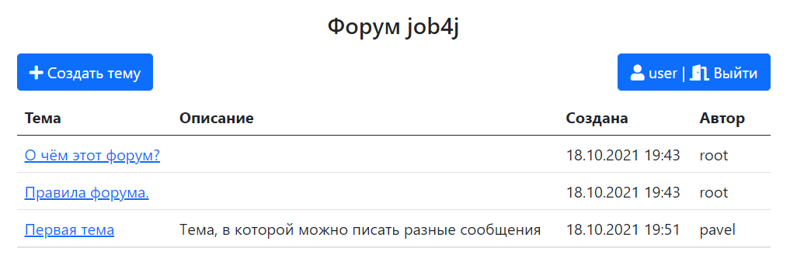
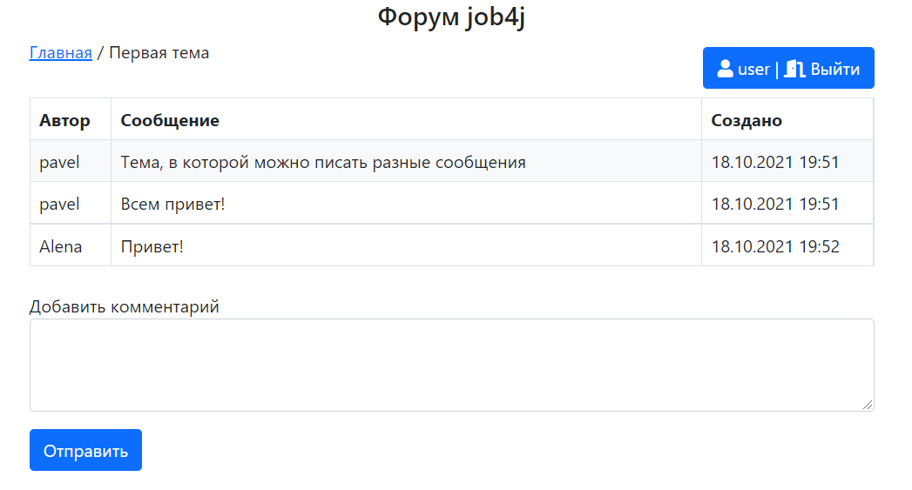
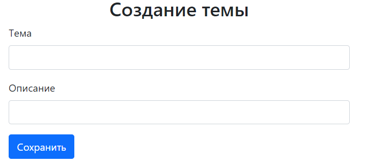

# job4j_forum

## О проекте
Проект представляет собой классический форум.

## Демо стенд [Heroku](https://nameless-fjord-37166.herokuapp.com/login):
Для входа нужно зарегистрироваться либо использовать следующие данные:
- имя - user
- пароль - user

## Функционал
- Авторизация и регистрация
- Создание тем 
- Редактирование тем
- Просмотр созданных тем
- Создание сообщений в темах

## Используемые технологии
- Spring (Boot, Security, Data)
- JSP/JSTL/Bootstrap
- PostgreSQL
- Junit, Mockito
- Liquibase
- Java 14
- Maven

## Демо
#### Общий вид

#### Просмотр темы

#### Создание темы

#### Вход

